# Deep Learning for Predict and Interpret Watter Quality Data 

### 1 - Data and Model Preparation  

First all datasets are aggregated in a super dataset and samples that had Trub grater then 20 or Chl_a grater then 6
are ignored. in the next step a list of features are chosen for training and validation the models. the selected 
features are:
```
['Lat', 'Long', 'Depth', 'Temp','pH', 'Sal', 'Cond', 'EC25', 'Density', 'Chl_Flu', 'Chl_a', 'Turb', 'ORP', 'DO', 'Quant']
```
The correlation among variables is shown below:
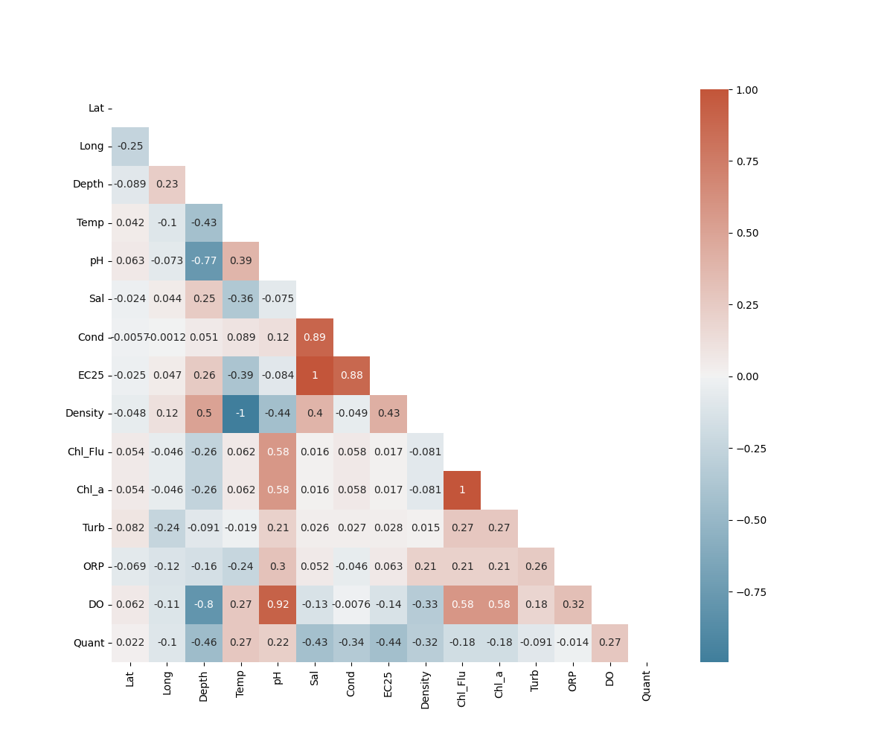 

After that a grid search is performed in order to find best features. R-square and MSE are used to 
evaluate the validation set and find the best combination of variables 
```
selected variables are ['Lat', 'Long', 'Depth', 'pH', 'Temp']
```
model schema 


| base line                                           | deep cross                                                    |
|-----------------------------------------------------|---------------------------------------------------------------|
| 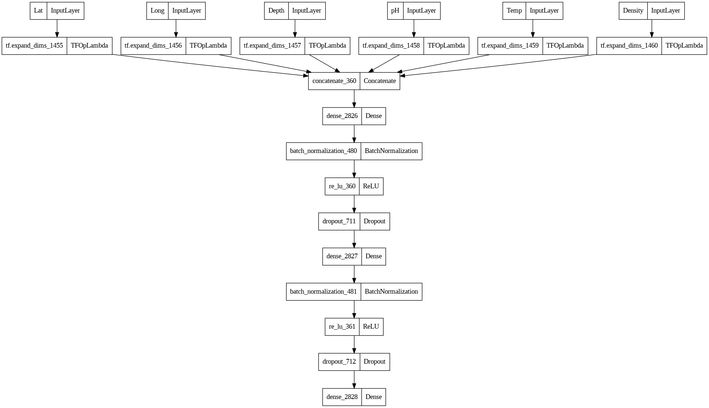           | 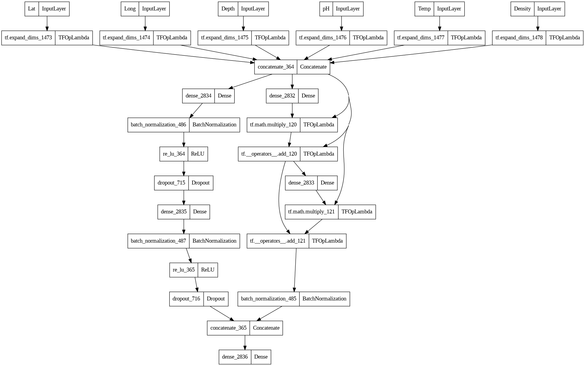         |
| wide deep                                           | variable selection                                            |
| 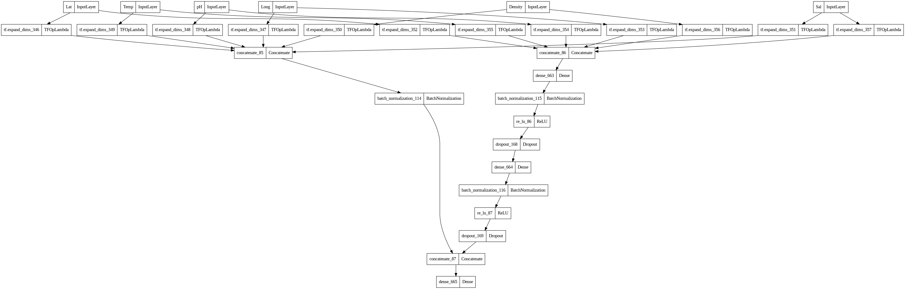 | 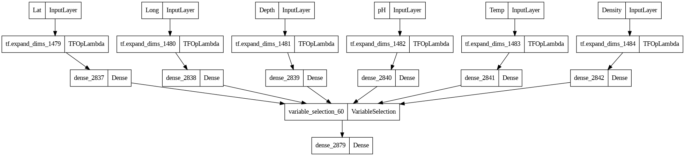 |

# Training the Models 
In this project 4 deep larning model are developed on keras framework and trained on chosen data.
```
models name ['base_line', 'wide_deep', 'deep_cross', 'variable_selection']
```
All data contain 28,434 are shuffled and divided to train, test, and validation set. 70 percent of data is 
used to training the models 15 for validation and 15 for test. All models are trained for 200 epochs.
It is worth to mention that an early stopping method is used to monitor validation and training 
loss with 30 epochs patience. if the model is not improved the training will be stopped and the last best 
model will be saved. this method prevent the network from overfiting. MSE is used for loss function and the
metrics that is reported is RMSE ,MSE ,R-square, and MAE. Model optimizer is Adam with 0.001 learning rate.
All data pass to model with Mini-batch of size 256, and it tacks 1 sec to model see whole data.
Some training result of variable selection can be seen below:


|          | Chl_a                             | DO                                |
|----------|-----------------------------------|-----------------------------------|
| loss     | 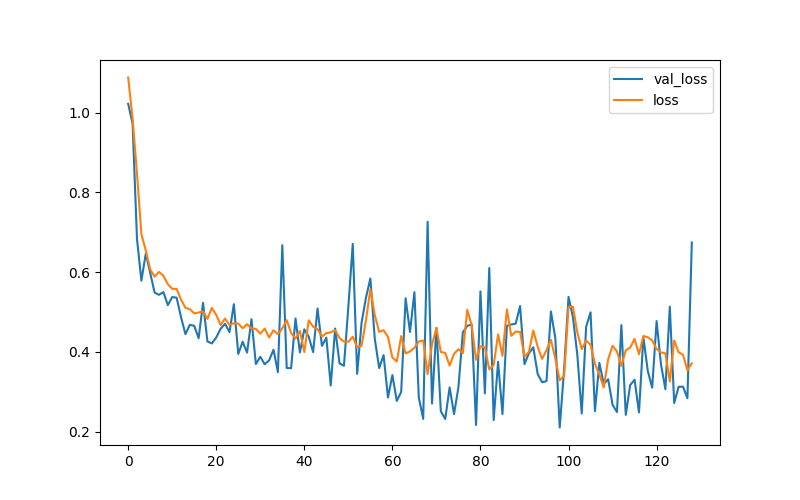 | 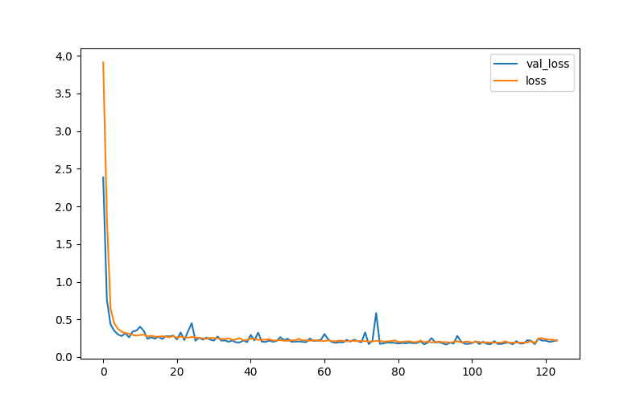 |
| R-square | 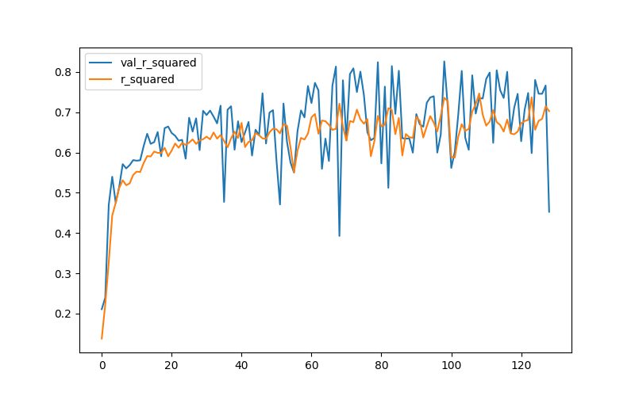     | 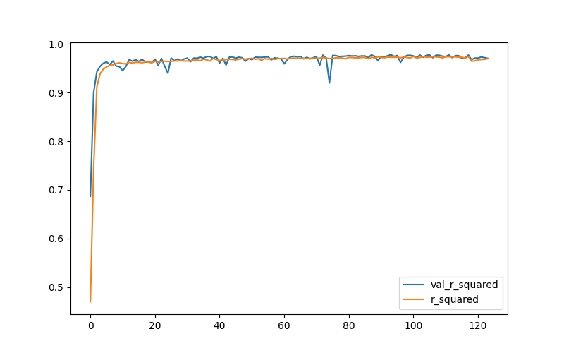     |

### test result DO

|                    | MSE   | R2    | MAE   | RMSE  |
|--------------------|-------|-------|-------|-------|
| base_line          | 0.259 | 0.964 | 0.167 | 0.509 |
| deep_wide          | 0.532 | 0.928 | 0.248 | 0.729 |
| deep_cross         | 0.211 | 0.97  | 0.155 | 0.46  |
| variable_selection | 0.142 | 0.98  | 0.115 | 0.377 |

### train result DO

|                    | MSE   | R2    | MAE   | RMSE  |
|--------------------|-------|-------|-------|-------|
| base_line          | 0.283 | 0.961 | 0.170 | 0.532 |
| deep_wide          | 0.580 | 0.921 | 0.256 | 0.761 |
| deep_cross         | 0.240 | 0.966 | 0.160 | 0.490 |
| variable_selection | 0.158 | 0.977 | 0.116 | 0.398 |

### train result DO

|                    | MSE   | R2    | MAE   | RMSE  |
|--------------------|-------|-------|-------|-------|
| base_line          | 0.284 | 0.962 | 0.166 | 0.533 |
| deep_wide          | 0.59  | 0.921 | 0.254 | 0.768 |
| deep_cross         | 0.245 | 0.967 | 0.158 | 0.495 |
| variable_selection | 0.165 | 0.977 | 0.115 | 0.407 |

## Interpret the Models 
According to the above result the best model is variable selection. 
it will be interpreted using 2 method
### first shape library 
Due to interpreting the deep models shap library uses the shaply value. After training 
variable selection model shap values are computed for all test data that are a bout 4000 sample, 
and then compute the importance of each feature in the model prediction. Kernel Explainer is the method that
is used for explaining the models. 


|           | Chl_a                                       | DO                              |
|-----------|---------------------------------------------|---------------------------------|
| bar       | 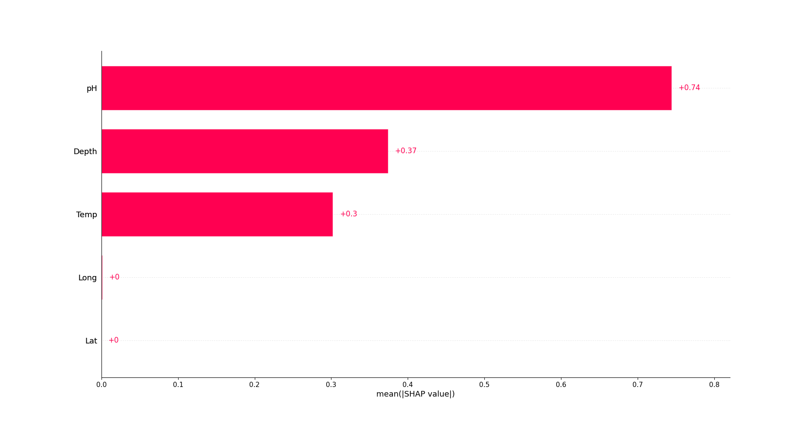             | 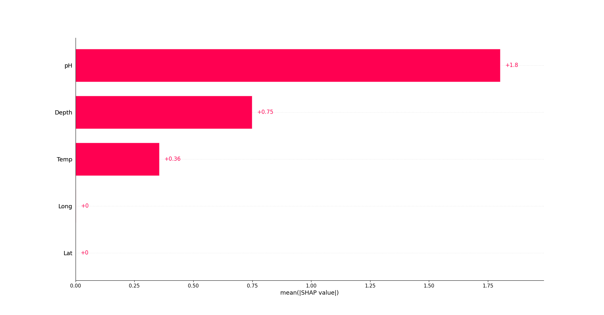       |
| beeswaram | 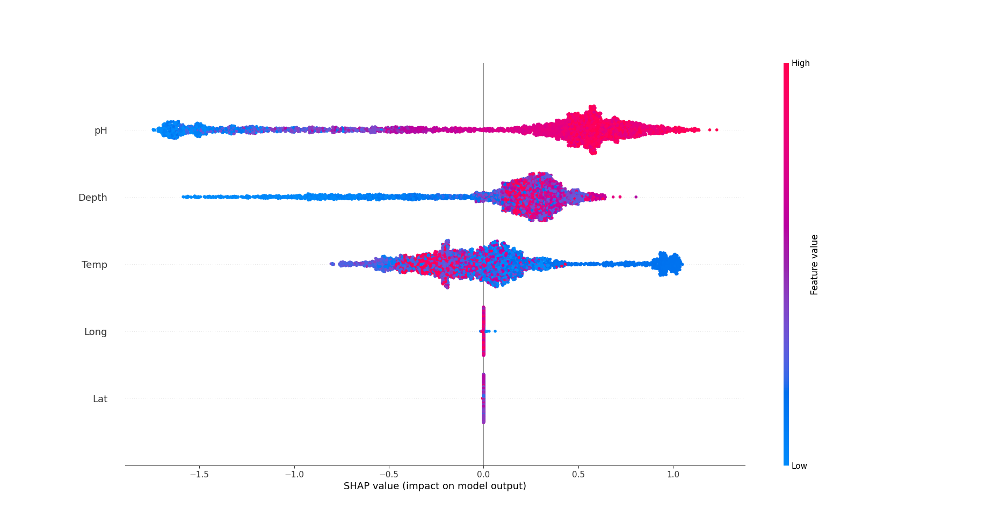 | 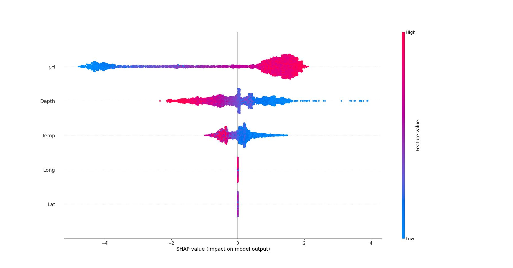       |
| violin    | 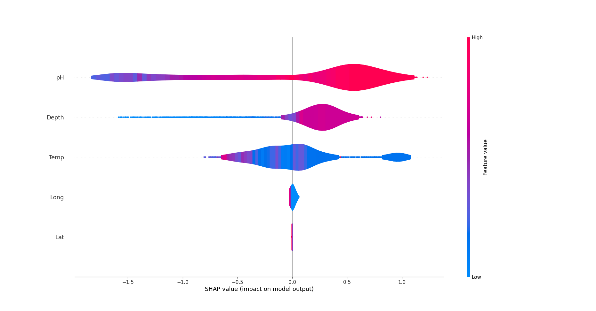       | 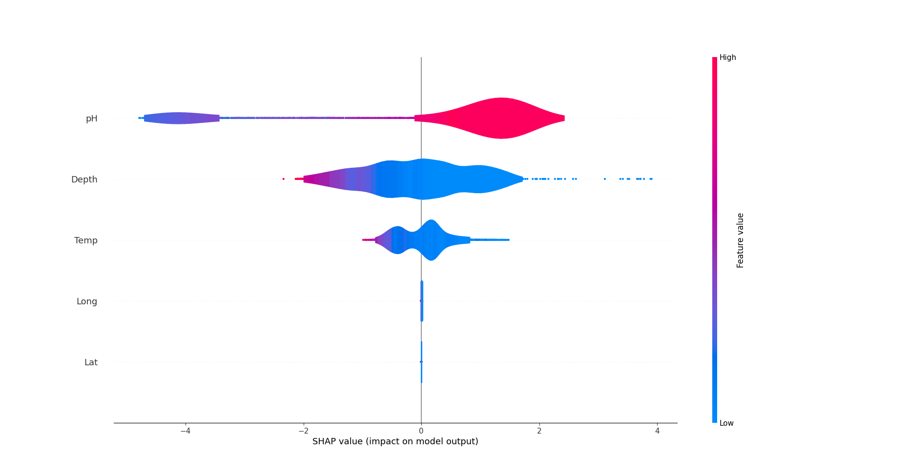 |


### second softmax weight 

One of the excellence of VSN is the ability of feature selection that can be gained using softmax 
weight in last part of VSN layer. this scores determine how much a feature should anticipate in decision-making 
of model. By passing each datapoint to the model and extracting the output of softmax layer as vector the mean of 
each feature importance can be computed that it is done for both chl_a and do and shown in figure below

|           | Chl_a                                   | DO                                |
|-----------|-----------------------------------------|-----------------------------------|
| bar       | 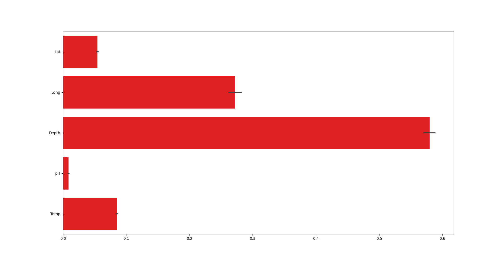 | 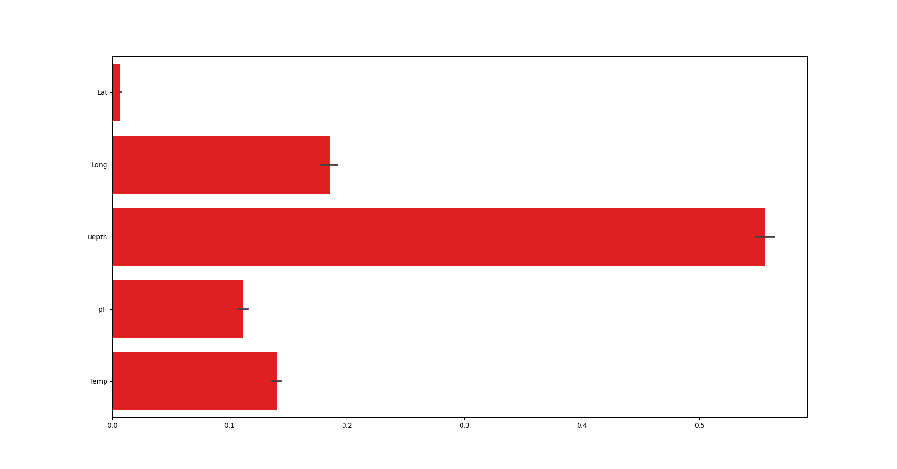 |


## Interpretation Method Comparison 

